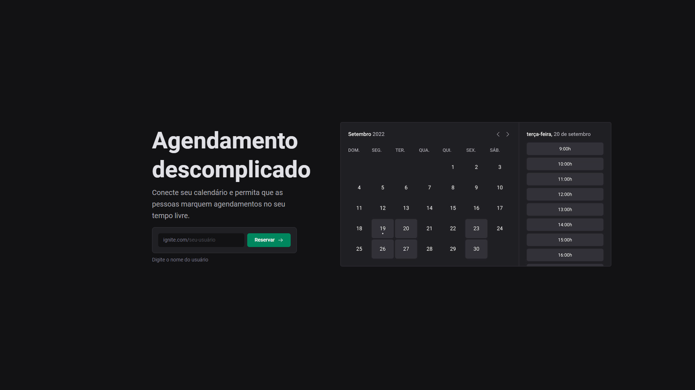

<p>
  
</p>

# 📆 Ignite Call 📆

O Ignite Call é uma aplicação focada na criação de eventos personalizados no calendário do usuário, onde você cadastra sua disponibilidade em dias e horas e compartilha com as pessoas para marcar reuniões, que serão agendadas no Google Agenda.

## ⚙ Como Executar

### Pré-requisitos

Antes de baixar o projeto você vai precisar ter instalado na sua máquina as seguintes ferramentas:

* [Git](https://git-scm.com)
* [NodeJS](https://nodejs.org/en/)
* [Yarn](https://yarnpkg.com/) ou [NPM](https://www.npmjs.com/)
* Para o banco de dados ter o [MySQL](https://www.mysql.com/) ou [Docker](https://www.docker.com/) para baixar a imagem do banco.

Além disto é bom ter um editor para trabalhar com o código como [VSCode](https://code.visualstudio.com/)

### Clonando e Executando

Passo a passo para clonar e executar a aplicação na sua máquina:

```bash
# Clone este repositório
$ git clone https://github.com/Victtor-777/Ignite_Call.git

# Acesse a pasta do projeto no terminal
$ cd ignite-call

# Instale as dependências
$ npm install

# Crie uma arquivo .env e preencha conforme apresentado no arquivo .env.example

# Executar seu banco de dados

# Executar o seguinte comando para criar as migrations no banco
$ npx prisma migrate dev

# Execute a aplicação em modo de desenvolvimento
$ npm run dev

# A aplicação inciará em alguma porta disponível que poderá ser acessada pelo navegador
```

## 🚀 Tecnologias

- [Design System próprio](https://github.com/rocketseat-education/05-design-system)
- [Typescript](https://www.typescriptlang.org/)
- [ReactJS](https://pt-br.reactjs.org/)
- [NextJS](https://nextjs.org/)
- [Eslint](https://eslint.org/)
- [Axios](https://axios-http.com/ptbr/docs/intro)
- [react-query](https://tanstack.com/query/v3/)
- [nookies](https://www.npmjs.com/package/nookies)
- [dayjs](https://day.js.org/)
- [phosphor-react](https://phosphoricons.com/)
- [next-auth](https://next-auth.js.org/)
- [next-seo](https://github.com/garmeeh/next-seo)
- [docker for db](https://docs.docker.com/desktop/install/windows-install/)
- [googleapis](https://www.npmjs.com/package/googleapis)
- [prisma](https://www.prisma.io/)
- [react-hook-form](https://react-hook-form.com/)
- [Zod](https://github.com/colinhacks/zod)

## 📝 Considerações

Este projeto serviu de base para reforçar os conhecimentos no framework NextJs, junto ao conceitos de API Routes, páginas SSG e SSR. Além disso, a aplicação possui conectividade com o GoogleAPIs, podendo marcar agendamentos no Google Calendar, além de gerar salas no Google Meet para as reuniões automaticamente.
